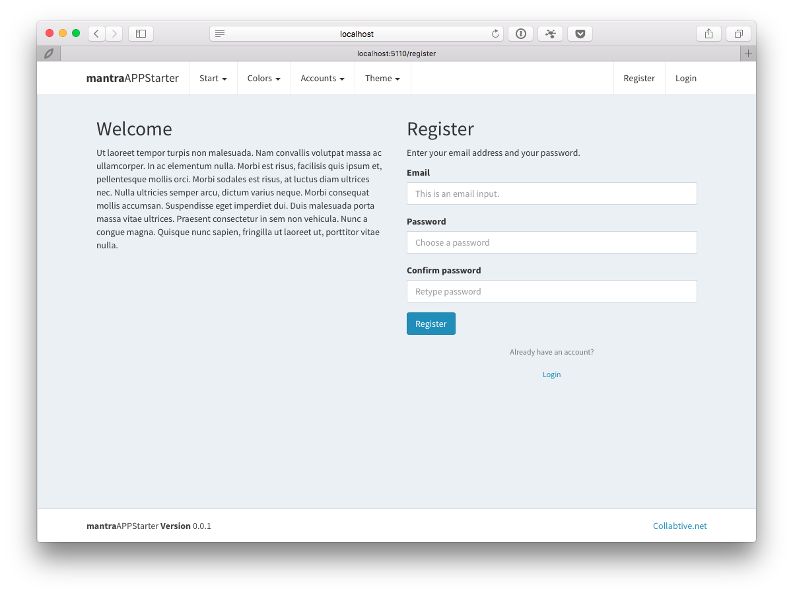
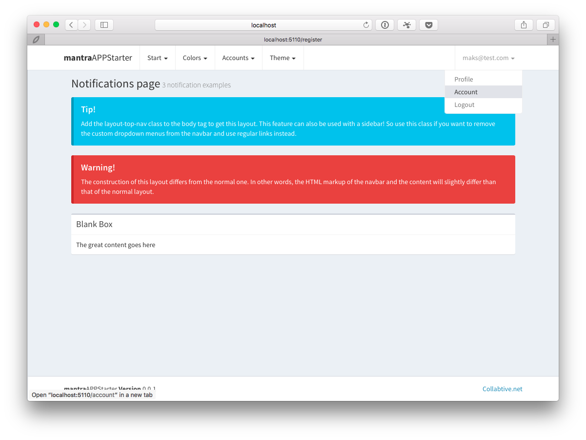

# meteor-mantra-kickstarter

## Bring your meteor mantra development up to speed

 For those who want to kickstart their project this is a an early attempt to bring some common user related functionalities with mantra application architecture to your app.

Please make sure you read [Mantra Specification](https://kadirahq.github.io/mantra/) and visit the [official repository](https://github.com/kadirahq/mantra). Keep in mind that Mantra is an approach to application architecture not a framework. It is supposed to keep our options open, whether we choose to bring react router, flow router, GraphQL, Redux or any other shiny new thing.

### Features

* A modified module structure (an [ongoing discussion](https://github.com/kadirahq/mantra/issues/3) on this matter
* Forms using the lovely [formsy-react](https://github.com/christianalfoni/formsy-react) and [formsy-react-components](https://github.com/twisty/formsy-react-components)
* User registration, login, logout with application wide state, composed in pure React JS components with [react-komposer](https://github.com/kadirahq/react-komposer) (there is no blaze ui, or any blaze to react)
* A theme module based on the [AdminLTE Control Panel Template] (https://almsaeedstudio.com/), you can replace it or remove if you have other requirements
* basic CRUD operations on a simple "Colors" module






### Setting Up

* Make sure you've installed Meteor locally
* Clone this repo

```
npm install
meteor --port 5005
```
Your app should be running [http://localhost:5005](http://localhost:5005)

### Roadmap

This is an early draft. Mantra architecture is very fresh and React environment is quite dynamic, that means things will change and break. We will be following the discussions and will try to keep this project up to date.

The goal is to bring some simple yet valuable to most apps features:

* user management
* role management
* permission management
* profile page
* account page
* advanced CRUD component with pagination
* file manager

### Running Tests (to be completed)

In this app, every part of the client side is fully tested using the familiar tools like Mocha, Chai and Sinon.

Run tests with:

```
npm test
```

**See package.json for more information about testing setup.**
