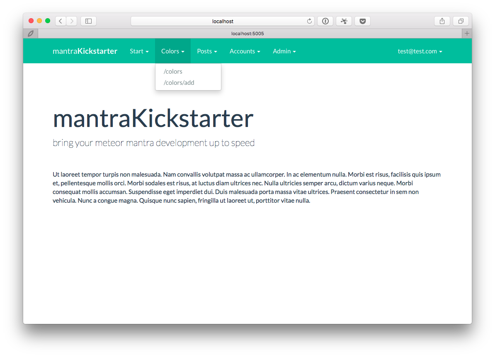
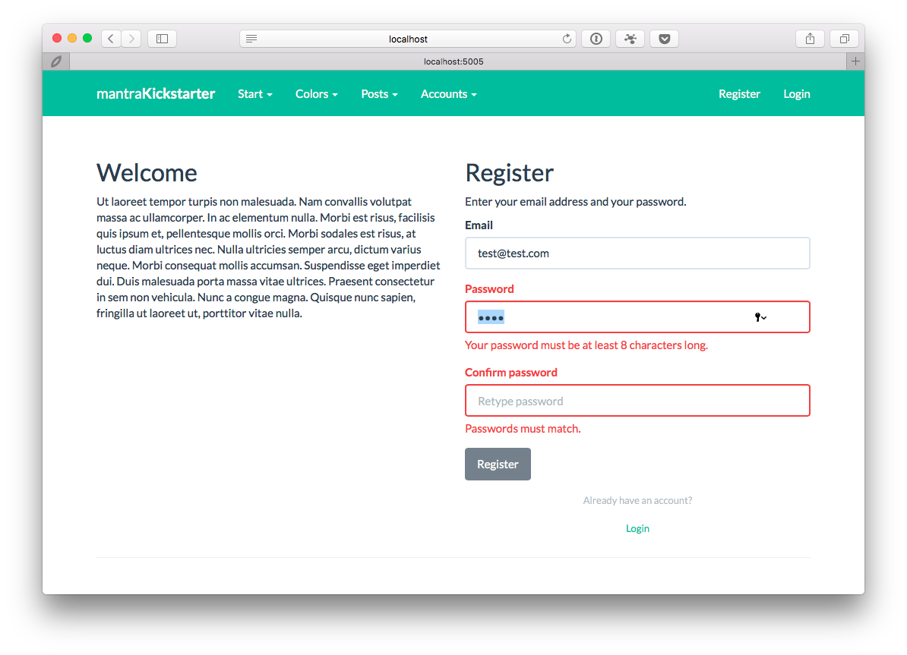
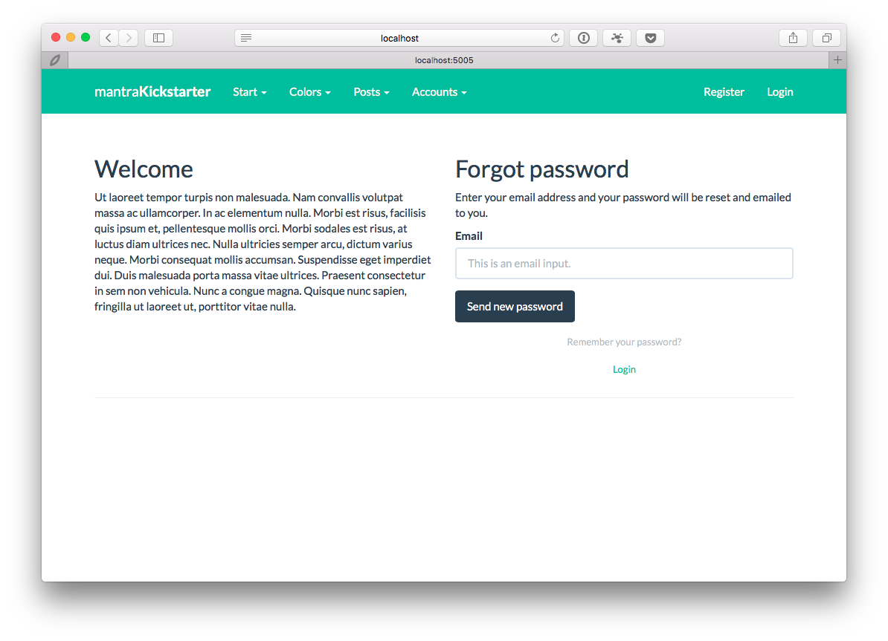
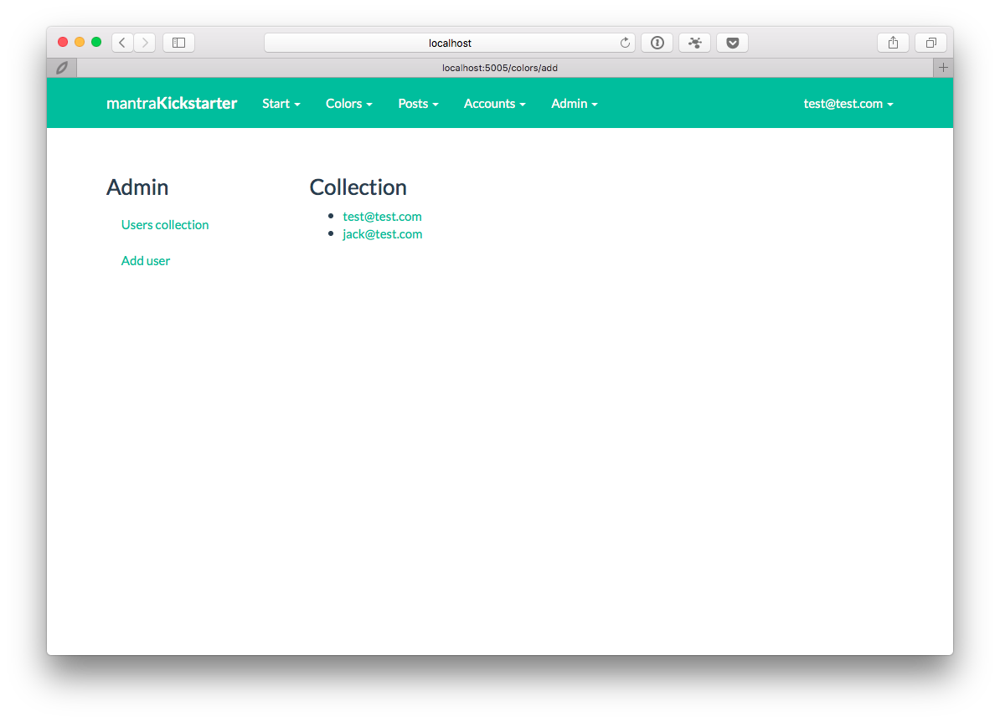
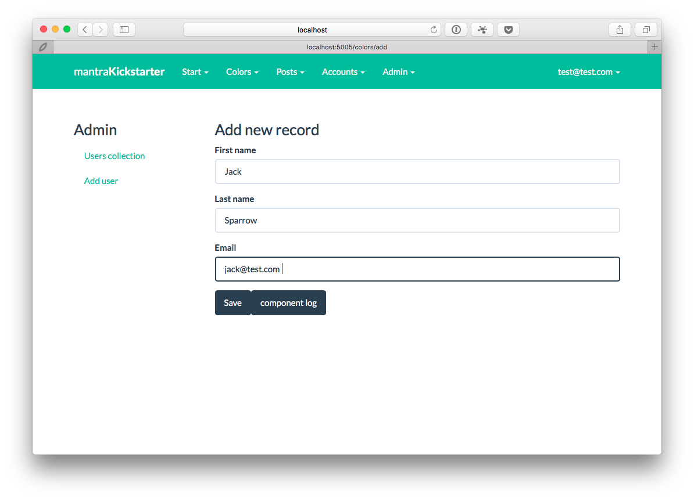
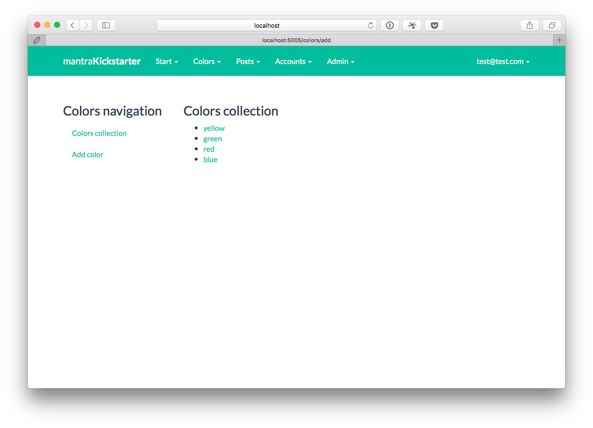
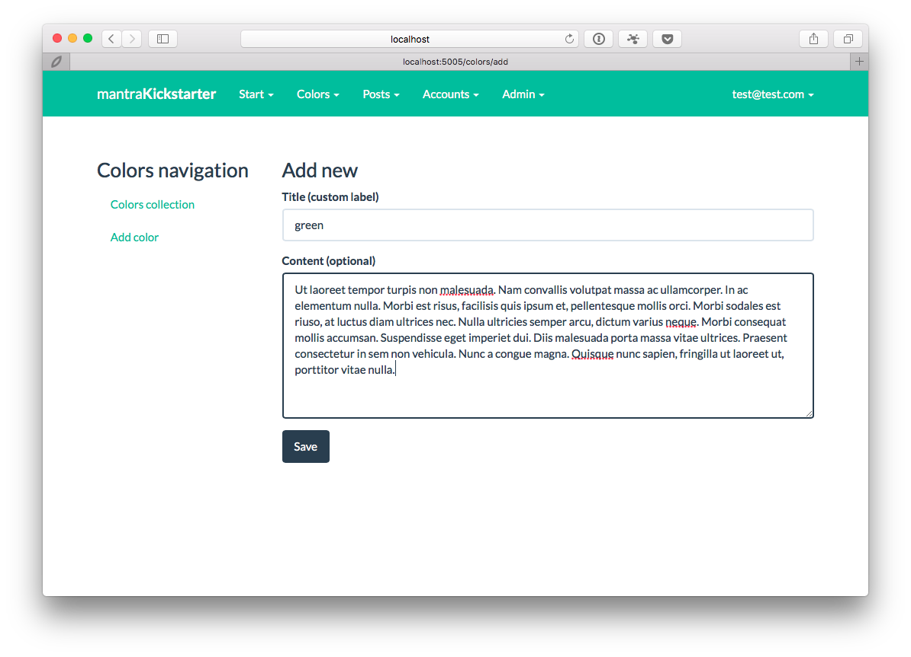
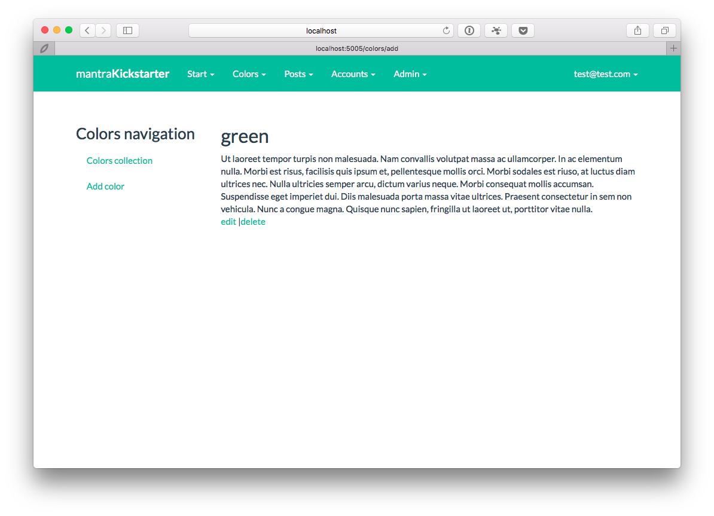

# meteor-mantra-kickstarter

### bring your meteor mantra development up to speed

Please make sure you read [Mantra Specification](https://kadirahq.github.io/mantra/) and visit the [official repository](https://github.com/kadirahq/mantra). Keep in mind that Mantra is an approach to application architecture rather than a framework. It is supposed to keep our options open and not lock us in to any particular library, we are free to choose how manage routing, state management and data-binding. In other words bring your own toolkit: flow router / react router GraphQL, Redux or any other shiny new thing.


### Features

* follows mantra feature specific modules approach, if interested please join an [ongoing discussion here](https://github.com/kadirahq/mantra/issues/3)

* formsy-react for user login, registration and password forms [formsy-react](https://github.com/christianalfoni/formsy-react) and [formsy-react-components](https://github.com/twisty/formsy-react-components)

* user registration, login, logout with application wide state, composed in pure React JS components with [react-komposer](https://github.com/kadirahq/react-komposer) (there is no blaze ui, or any blaze to react)

* simple but complete Colors modules wih CRUD

* simple but not fully complete user management module

* [tcomb-form](https://github.com/gcanti/tcomb-form) based forms in Colors module.

* [meteor astronomy](https://github.com/jagi/meteor-astronomy) models (looking forward to the upcoming v2)

* bootstrap theme module based on [Flatly](https://bootswatch.com/flatly/) with a configuration file, you can replace it or remove if you have other requirements



















### Setting Up

* make sure you have Meteor installed
* clone this repo
* make sure you are on v0.2.1 branch

```
npm install
meteor --port 5005
```
Your app should be running [http://localhost:5005](http://localhost:5005)

### Roadmap

This is an early draft. Mantra architecture is very fresh and React environment is quite dynamic, that means things will change and break. We will be following the discussions and will try to keep this project up to date.

The goal is to bring some simple yet valuable to most apps features:

* user management
* role management
* ACL management
* profile page
* account page
* advanced CRUD component with pagination
* file manager

### Running Tests (to be completed)

In this app, every part of the client side is fully tested using the familiar tools like Mocha, Chai and Sinon.

Run tests with:

```
npm test
```

**See package.json for more information about testing setup.**
